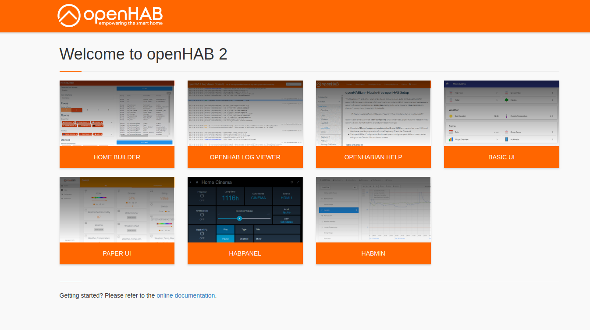
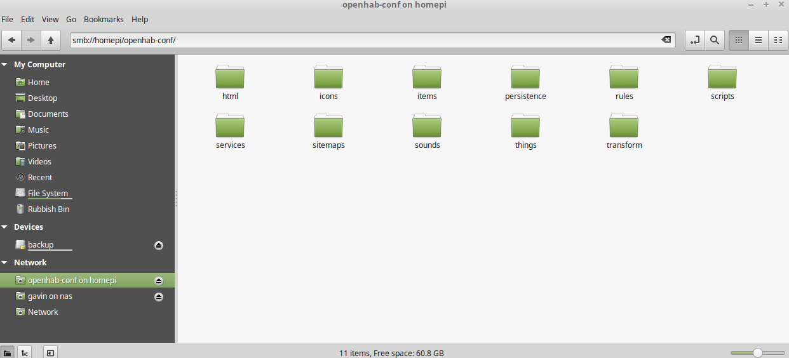
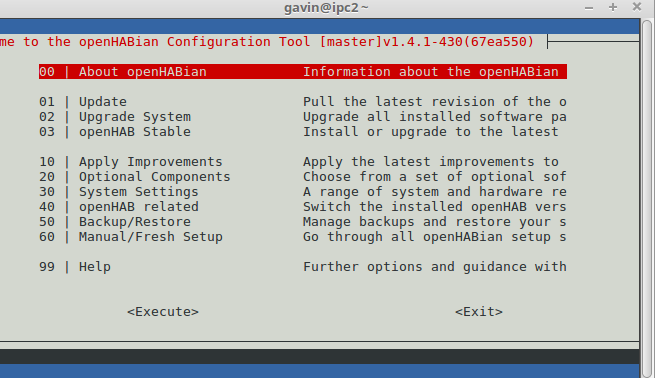
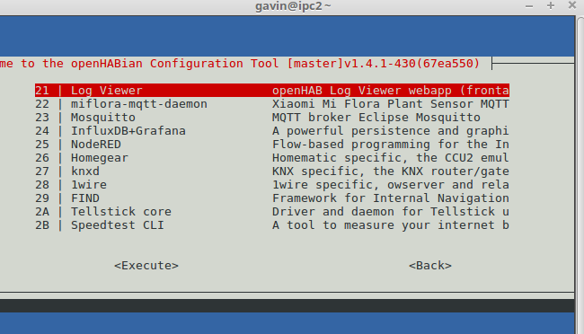
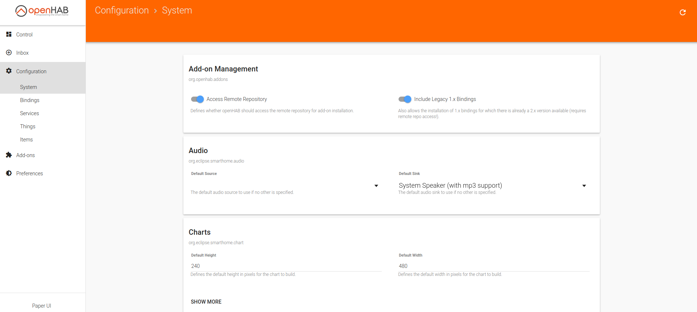
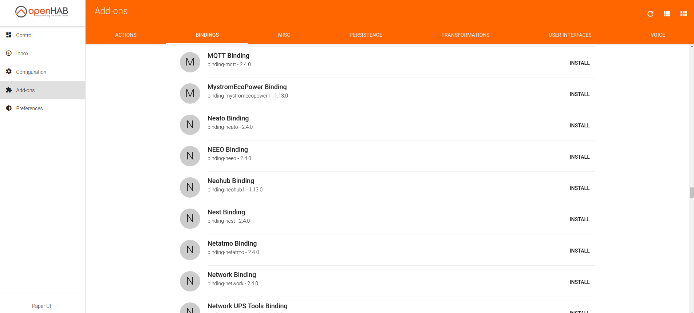

# Openhab install guide.

##**Introduction**

Openhab is an open source home automation system that can run on different hardware platforms.
I recommend using a [Raspberry Pi](https://www.raspberrypi.org/products/raspberry-pi-3-model-b-plus/).

These are simple but powerful tiny computers, that dont take much power.  

More information on openhab is available [here](https://www.openhab.org/) 

Below is a guide to install OpenHab on a raspberry pi.   All links are correct as of 21 dec 2018.

##**Openhabian**

[Openhabian](https://www.openhab.org/docs/installation/openhabian.html)  is a port of OpenHab that is designed for ease of installation on a Raspberry Pi.  Below is a step by step guide to installation.  
If links are out of date please contact me.

**1. Download Openhabian**

The Github page for Openhabian will have the latests releases [here](https://github.com/openhab/openhabian/releases) 

The latest RaspBerry Pi image is [here](https://bintray.com/openhab/bin/download_file?file_path=openhabianpi-raspbian-201804031720-gitdba76f6-crc9e93c3eb.img.xz) This is a large download at
circa 255Mb.  The downloaded file needs to be written to the micro SD card that came with the Raspberry Pi.
As it is an image of a disk it needs to be extracted then written, various tools exist to do this I suggest using etcher.

**2. Etcher**

Etcher is a tool to write disk images to SD cards, it is available [here](https://www.balena.io/etcher/).
Once Etcher is installed simply select the image file you downloaded, then select the drive containing the 
Micro SD card then press Flash.

This will extract the files and check them.

**3. Update wifi details**

If you plan to use wifi on the raspberry pi you will need to update the wifi credentials.  If not move to step 4.

Access the first SD card partition from the file explorer of your choice (e.g. Windows file explorer)
Open the file openhabian.conf in a text editor
Uncomment and fill in wifi_ssid="My Wi-Fi SSID" and wifi_psk="password123"

This adds your wifi details

**4. Start install.**

Unmount the micro SD card then insert into the Pi.    The system is designed to run "headless" i.e no monitor, but a monitor can be plugged into the HDMI port.

Put the micro SD card into the pi and power on, if you skipped step 3 plug in the network cable first.   Grab a beer/tea and come back in an hour.

** 5. Connect to server**

In a web browser connect to http://ipaddress:8080 the first time you connect you should see a screen asking you to select "simple standard expert demo"  select the expert option then you should see various screens.

PaperUI is used to configure the server.

connecting to http://ipaddress:9001 will show you the log file.

Using filemanger on your PC you should be able to connect to a network drive with a username and password
of openhabian  this will allow you to change the configuration files.

Also use ssh in a command line to connect to the server username and password again openhabian.  (For information on ssh see [ssh.md](./ssh.md) )

then run "sudo openhabian-config"  this then starts a configuration program.

**6. update system**

In the openhabian-config program select the first option (01) to down load the updates to the system.  

Then the second option (02) to install the updates, this may take some time.

Then go to the "Apply latest improvements" menu (10)

Click on each item to change the system.

**7. Static ip address**

The ip address of the raspberry pi needs to be a fixed address so it does not change every time it is rebooted.  To do this log onto your route and reserve the ip address in the DHCP section.  Details of how to do this will vary according to router but information on how to to do this can be found online.

**8. Install MQTT**

Still in openhab-config go to the "Optional Components" section in the main menu.

Click on (23) Mosquitto to install the MQTT server, you can select all the default options.

**9. Install bindings**

Openhab uses a system of optional bindings to enable the system to work.   These bindings are continuously updated enabling the server to connect to and control differing devices.

Openhab-trains currently needs 4 bindings to be installed to work.

In a web browser connect to the server http//ipaddress:8080. 

Select the paper UI panel and then configuration - system and ensure
"include legacy 1.x bindings" is set on.

Select the paper UI panel and then addons - bindings.  Find the MQTT binding and install it.

Then still in paper UI go to addons - persistence and install the MQTT Persistence binding.

Next is the MQTT action binding which is in addons - actions.  Install the MQTT action binding.

Finally the MAP Transformation which is in addons - transformations.
Install the MAP transformation.